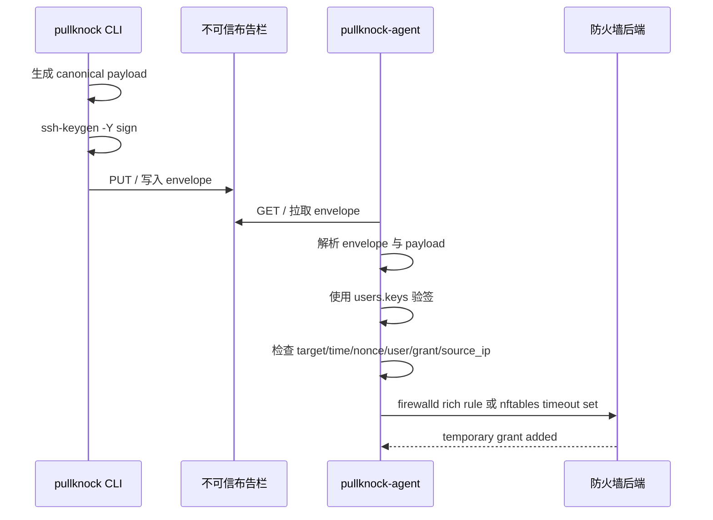

# 00-项目总览

## 项目目标

PullKnock 是一个轻量级 Python 工具，用于实现“反向拉取式”的动态防火墙授权。

目标效果：

- 服务器不暴露 knock 服务端口。
- SSH 默认不可从公网直接访问。
- 客户端用 OpenSSH 私钥，推荐 YubiKey/FIDO2 security key，签名一次性授权 payload。
- 签名 envelope 可明文或 age 加密后发布到一个或多个固定 HTTP/HTTPS、FTP/FTPS、IPFS/IPNS、S3 兼容对象存储位置或本地文件。
- 服务器 agent 主动轮询这些位置，验签、防重放、检查本地授权策略后，临时开放 firewalld runtime rule 或 nftables timeout set。

## 核心结论

PullKnock 的安全边界不是 URL 保密性，而是：

- 用户私钥签名。
- agent 使用 `users.<principal>.keys` 验签。
- payload 短时效。
- SQLite nonce DB 防重放。
- agent 本地 YAML grant 白名单。
- firewalld `--timeout` 或 nftables set `timeout` 自动回收。

固定页面、publisher 服务、对象存储、WebDAV、FTP/FTPS 或 IPFS gateway 都只是不可信消息投递通道。

## 系统组件

```text
pullknock CLI
  生成 payload -> SSHSIG 签名 -> 发布 envelope

pullknock-publisher
  可选 HTTP 布告栏服务，只负责 PUT/GET envelope，可用 latest 或 queue endpoint

pullknock-agent
  轮询 envelope -> 验签 -> 防重放 -> 权限校验 -> 调用防火墙后端
```

## 总体流程



## 当前实现状态

已实现：

- `pullknock open` CLI。
- SSHSIG 签名和验签。
- `plain+sshsig` envelope v1。
- `age+plain+sshsig` 加密 envelope v1。
- 带 `encryption_key_id` 和 `encryption_alg` 的 age 加密 envelope v2。
- file publisher。
- HTTP PUT publisher。
- WebDAV publisher。
- FTP/FTPS publisher 和 fetcher。
- IPFS/IPNS publisher。
- S3 兼容对象存储 publisher。
- 内置 `pullknock-publisher` HTTP 布告栏服务。
- publisher latest 和 command queue endpoint。
- agent HTTP/FTP/file 拉取。
- 用户内联公钥验签和 key 级 enabled/有效期策略。
- SQLite nonce 防重放。
- YAML 多用户和 grant 权限控制。
- 用户组、组级权限和 grant 继承。
- 多服务器配置生成工具 `pullknock-configgen`。
- 本地 Web 管理界面 `pullknock-admin`。
- Web 管理写接口 CSRF token、Origin/Referer 和 JSON Content-Type 防护。
- 多 control URL fallback。
- firewalld rich rule dry-run 与执行。
- nftables timeout set dry-run 与执行。
- 审计日志落文件和 logrotate 示例。
- SIGHUP 配置 reload。
- firewalld 重复授权刷新 timeout。
- systemd 示例。
- 中文 README 和示例配置。

暂未实现：

- 中央管理后台。
- agent status ack / CLI `--wait` 回执通道。
- Windows service。
