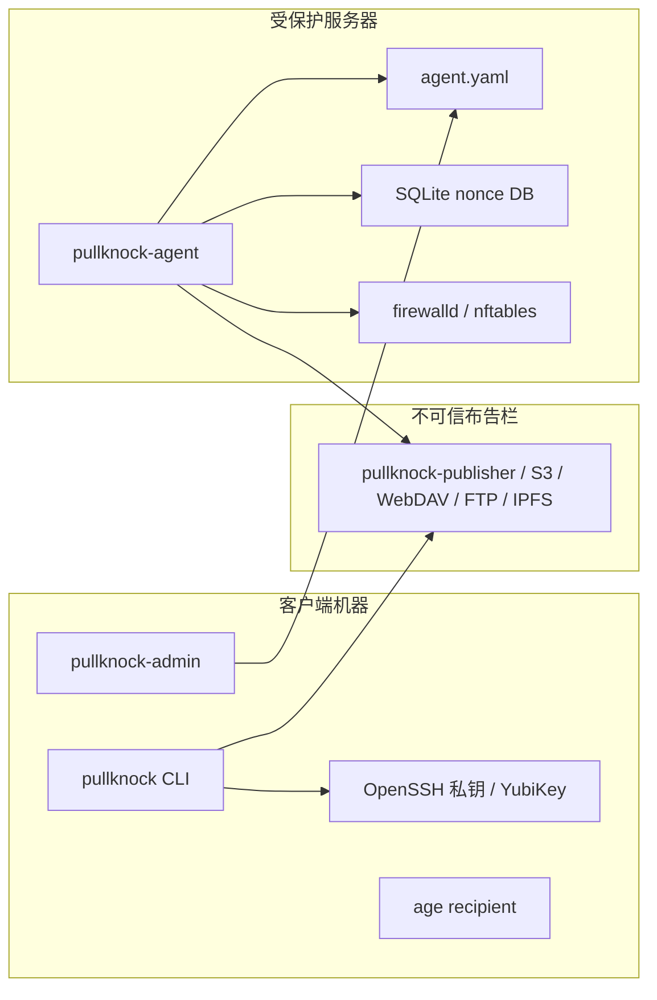
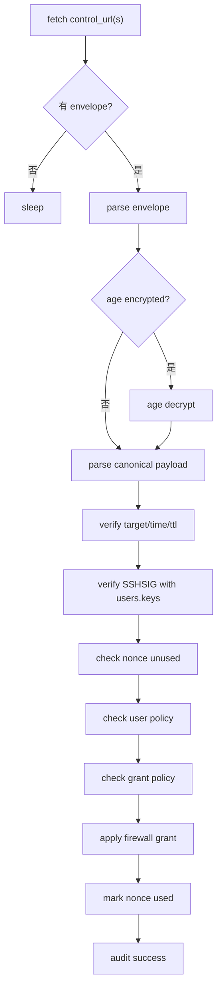

# 02-系统架构

## 组件关系

## 模块职责

| 模块 | 职责 |
| --- | --- |
| `cli.py` | CLI 命令入口，生成 payload，签名并发布 envelope。 |
| `agent.py` | agent 命令入口，拉取 envelope，执行校验与授权。 |
| `publisher_server.py` | 内置 HTTP 布告栏服务。 |
| `config.py` | YAML 配置加载、类型转换和基础校验。 |
| `protocol.py` | payload/envelope 构造、解析和 canonical 校验。 |
| `crypto.py` | 调用 age 做 envelope 加密和解密。 |
| `signing.py` | 调用 `ssh-keygen -Y sign/verify`。 |
| `publisher.py` | CLI publisher 抽象，支持 file、HTTP PUT、WebDAV、FTP/FTPS、IPFS/IPNS、S3。 |
| `configgen.py` | 从 inventory 生成多服务器 agent/CLI 配置。 |
| `admin_server.py` | 本地 Web 管理界面，查看、校验、保存和 reload agent 配置。 |
| `fetcher.py` | agent fetcher 抽象，支持 HTTP/HTTPS、FTP/FTPS、file。 |
| `firewall.py` | firewalld rich rule 和 nftables timeout set 构造与执行。 |
| `nonce_store.py` | SQLite 防重放存储。 |
| `audit.py` | JSON 审计日志。 |

## Agent 处理流程

## 失败模式

| 失败点 | 预期行为 |
| --- | --- |
| 单个 control URL 不可达 | 尝试下一个 fallback URL。 |
| 全部 control URL 不可达 | 记录错误或忽略本轮，不影响已存在 runtime rule。 |
| envelope 为空 | 本轮 idle。 |
| JSON 非法 | 拒绝并记录审计日志。 |
| age 解密失败 | 拒绝，不验签，不写 nonce。 |
| 签名失败 | 拒绝，不写 nonce。 |
| command_id 重复 | 忽略，不重复开放端口。 |
| 权限不匹配 | 拒绝，不调用防火墙后端。 |
| 防火墙后端失败 | 记录失败，不写 nonce。 |

## 数据所有权

- CLI 配置归客户端用户所有。
- agent 配置是服务端授权事实源。
- publisher 只保存最新 envelope，不拥有授权语义。
- nonce DB 只保存防重放历史。
- 防火墙后端拥有临时放行生命周期。
